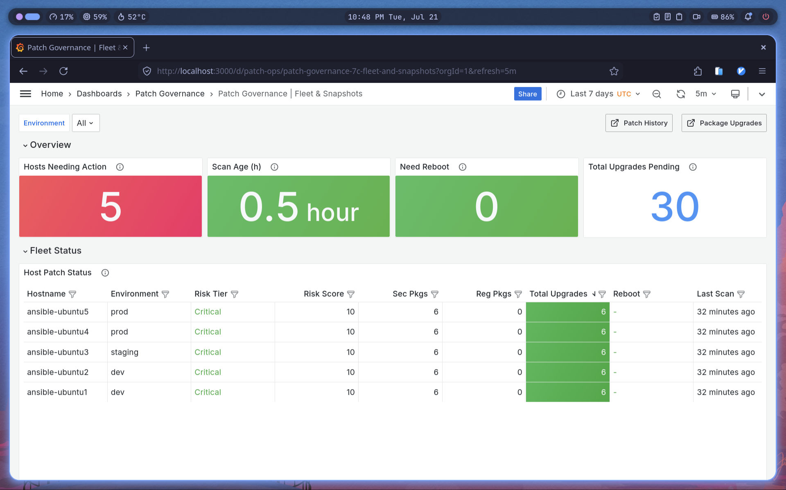
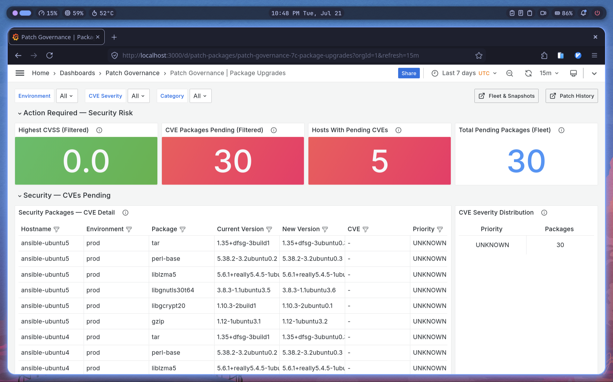
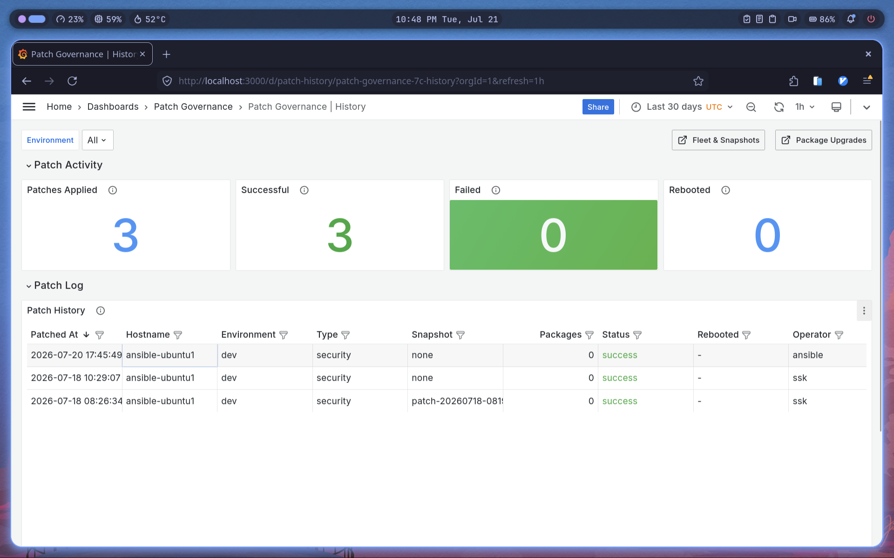
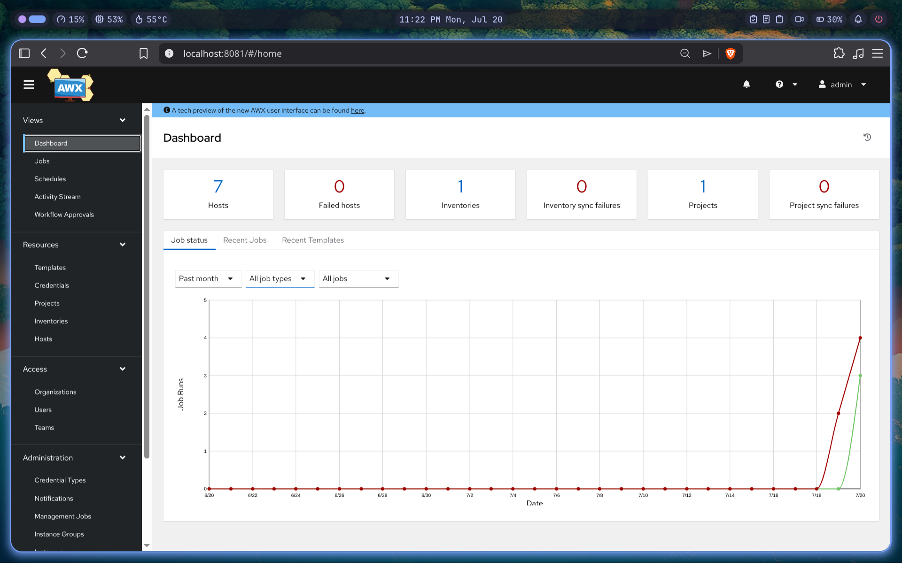
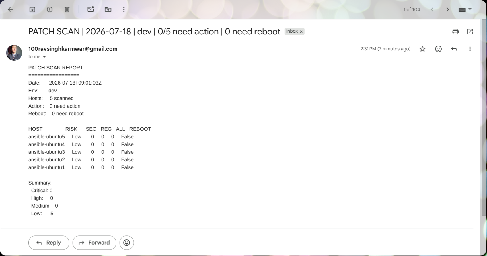
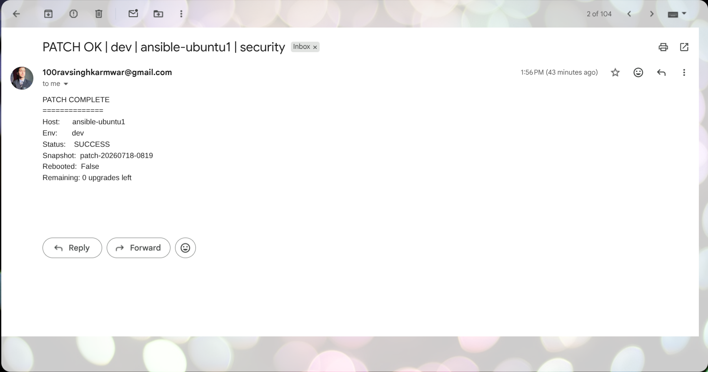
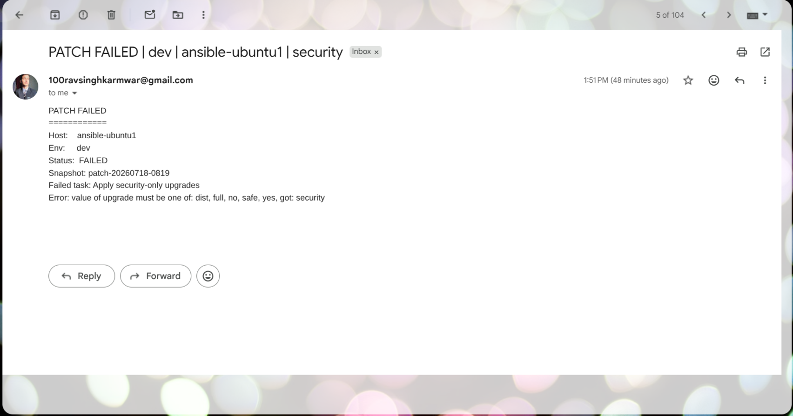

# PatchOps

> Governed package promotion from source to server.

A self-contained Linux patch governance platform: **Aptly** mirrors upstream Ubuntu repos and cuts immutable snapshots, **AWX** orchestrates the promotion pipeline on a schedule, **Ansible** does the actual patching, and **Grafana** shows what's true about the fleet right now — not what a report claimed last week.

This is a from-scratch rewrite of patterns used in a real production patch-governance system (`infra-engine`), rebuilt as a portable, single-machine project. Nothing here is copy-pasted — every role, playbook, and AWX config was written fresh for this repo.

---

## What it does

```
Upstream Ubuntu mirrors (jammy/noble, security/updates/backports)
        │  aptly mirror update            ◄── daily, 01:00 UTC
        ▼
Immutable snapshot (patch-YYYYMMDD-HHMM)
        │  aptly snapshot merge + publish
        ▼
   dev  ──24h bake──►  staging  ──48h bake──►  prod
        │                                        │
        ▼                                        ▼
  apt upgrade on clients                  rolling apply, serial-controlled
        │
        ▼
  email + Postgres audit trail + Grafana dashboards
```

- **Aptly** is the single source of truth for packages — clients never talk to the public internet.
- **Promotion is time-gated, not vibes-gated**: staging requires a snapshot to have sat in dev for 24h, prod requires 48h in staging. The gate is a SQL assertion the playbook itself enforces, not a person remembering to wait.
- **Rollback is real.** Re-publishing an old snapshot only changes what the repo serves — it doesn't touch a host that already installed the bad version. `rollback.yml` also downgrades already-patched clients back to match the snapshot.
- **AWX runs the whole thing on a schedule** and gives you a web UI, job history, and credentials management instead of cron + SSH keys on a laptop.

---

## Screenshots

**Fleet status and package upgrades, live from the governance DB:**

| | |
|---|---|
|  |  |
| 5 hosts, real risk scoring, 30 pending upgrades | Real package names and versions per host |

**Patch history — the "Successful" counter actually counts successes:**



**AWX orchestrating the pipeline:**



**Email notifications on every scan and patch run:**

| Scan report | Patch succeeded |
|---|---|
|  |  |

The notification pipeline also reports failures with the actual error, not a generic "something broke" — caught here during earlier development, when an invalid `apt` module argument slipped through:



---

## Architecture

| Component | Role |
|---|---|
| **Aptly** (bare metal / container) | Mirrors upstream repos, cuts snapshots, publishes `dev`/`staging`/`prod` |
| **Ansible** | `aptly-client`, `setup_aptly`, `setup_govdb`, `notify` roles + playbooks for scan/patch/promote/rollback |
| **PostgreSQL (`patchgov`)** | Governance DB — `scan_results`, `scan_package_details`, `patch_history`, `snapshots` |
| **AWX** (`awx/`) | Custom standalone build (`2ssk/awx-standalone`), Docker-based EE isolation, 14 job templates, 7 schedules |
| **Execution Environment** (`execution-environment/`) | `2ssk/patchops-ee` — Fedora 42, ansible-core 2.17.14, `community.general` + `community.postgresql` |
| **Grafana** | 3 dashboards reading directly from `patchgov` — Fleet & Snapshots, Package Upgrades, Patch History |

Secrets are ansible-vault encrypted end to end (`group_vars/all/vault.yml`) — the governance DB password, Grafana admin password, and SMTP credentials all resolve through one vaulted source, consumed identically by CLI runs and AWX job templates.

---

## Quick start

```bash
# 1. Governance DB + Grafana
docker compose up -d

# 2. Aptly + Ubuntu lab fleet (5 clients + 1 aptly host)
docker compose -f compose.lab.yml up -d

# 3. Vault setup (one-time)
echo -n 'your-random-password' > .vault_pass
cp group_vars/all/vault.yml.example group_vars/all/vault.yml
# edit group_vars/all/vault.yml with real values, then:
ansible-vault encrypt group_vars/all/vault.yml

# 4. Bootstrap
ansible-playbook playbooks/setup_govdb.yml
ansible-playbook playbooks/setup-aptly.yml
ansible-playbook playbooks/init-aptly.yml     # one-time: create mirrors, first snapshot+publish

# 5. Run the pipeline directly
ansible-playbook playbooks/patch-scan.yml
ansible-playbook playbooks/patch-security.yml
ansible-playbook playbooks/promote-staging.yml   # fails until the snapshot has soaked 24h in dev
ansible-playbook playbooks/promote-staging.yml -e "skip_soak=true"   # testing override, logs a warning
```

**Or drive it all through AWX:**

```bash
cd awx
cp .env.example .env      # fill in SSH_KEY_PATH, AWX_SECRET_KEY, AWX_VAULT_PASSWORD, etc.
docker compose up -d
ansible-playbook awx/configure.yml   # creates inventory, 14 job templates, 7 schedules
```

AWX comes up on `:8081` (not `:8080` — that's aptly's own API port). `2ssk/patchops-ee` and `2ssk/awx-standalone` are prebuilt on Docker Hub; `execution-environment/build.sh` and `awx/build.sh` rebuild them from source if you need to.

---

## What's real, what's a demo shortcut

- The mirror sync is a **real** multi-GB download of Ubuntu Noble (`main restricted universe multiverse` across 4 components) plus Docker/NodeSource/Nginx third-party repos — expect it to take a while on first run, not seconds.
- The lab fleet (`compose.lab.yml`) boots bare `ubuntu:24.04` images and installs SSH/Python on every start — OS-level packages installed by Ansible afterward (aptly, nginx) do **not** survive a container restart, only `/var/cache/aptly` and the client home volumes do. Fine for a demo lab; not how you'd run this against real hosts.
- CVE severity/priority columns in the Package Upgrades dashboard are honestly `UNKNOWN` — there's no CVE enrichment pipeline (no NVD/USN lookup) yet, so the schema exists but isn't populated. The dashboard doesn't pretend otherwise.

---

## Repository layout

```
playbooks/          patch-scan, patch-security, promote-*, rollback, setup-*, init-aptly
roles/               aptly-client, setup_aptly, setup_govdb, notify
group_vars/all/      vault.yml (encrypted, gitignored) + vars.yml
awx/                 custom AWX standalone image, docker-compose, AWX-as-code (configure.yml)
execution-environment/  patchops-ee build spec
grafana/             dashboards + datasource provisioning
compose.yml          govdb + grafana
compose.lab.yml      aptly + 5-host demo fleet
```

---

## Known gaps

- No automated tests beyond `yamllint`/`ansible-lint`/syntax-check CI — nothing runs the pipeline functionally in CI yet.
- No CVE enrichment (NVD/USN lookup) — security packages are flagged, but not scored.
- Prod promotion is soak-time gated, not human-approved; there's no workflow-approval step.

---

## License

MIT — see [LICENSE](LICENSE). Copyright (c) 2026 Saurav Singh Karmwar.
